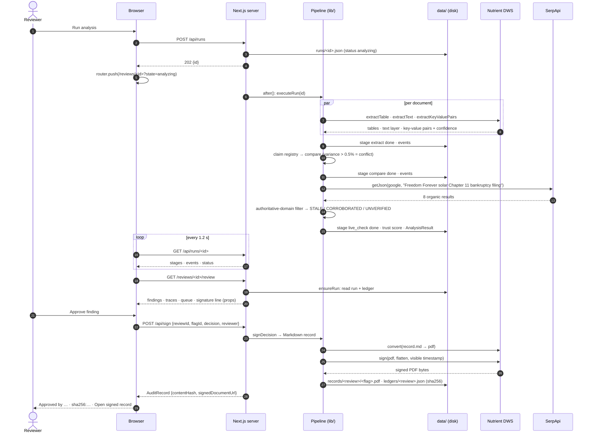
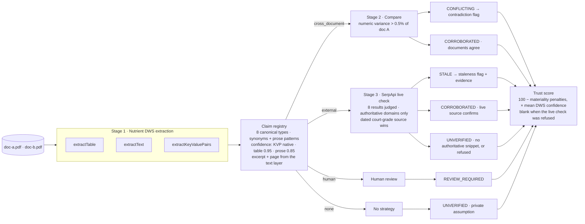

# Sparkline — architecture

How Nutrient DWS and SerpApi fit into one document-trust pipeline. The
diagrams are Mermaid; GitHub renders them, and Lucidchart imports them
(Insert → Diagram as code → Mermaid).

## System map

```mermaid
flowchart LR
  subgraph browser [Browser]
    landing["/ Landing<br/>Launch Sparkline"]
    newrev["/reviews/new<br/>Run analysis"]
    analysis["/reviews/[id]<br/>LiveRunPanel polls, then replay"]
    workspace["/reviews/[id]/review<br/>queue · evidence · query trace · decision bar"]
    ledgerui["/reviews/[id]/audit<br/>audit ledger"]
    viewer["Document viewer<br/>Nutrient Web SDK (WASM, client-side)"]
  end

  subgraph server [Next.js server]
    runs["POST /api/runs<br/>createRun → 202 {id}<br/>after(): executeRun"]
    runstatus["GET /api/runs/[id]<br/>status · stages · events"]
    pages["Server pages<br/>ensureRun(id) → accessors"]
    sign["POST /api/sign<br/>DELETE withdraws"]
    records["GET /api/records/[review]/[flag]<br/>serves the signed PDF"]
  end

  subgraph storage [Storage · data/ (gitignored)]
    runfile[("runs/&lt;id&gt;.json<br/>stages · events · AnalysisResult")]
    ledger[("ledgers/&lt;review&gt;.json<br/>AuditRecord rows")]
    pdfs[("records/&lt;review&gt;/&lt;flag&gt;.pdf<br/>DWS-signed bytes")]
    pub[("public/<br/>nutrient-viewer-lib · doc-a.pdf · doc-b.pdf")]
  end

  subgraph pipeline [Pipeline + data layer]
    bundle[("documents/doc-a.pdf · doc-b.pdf<br/>committed sample bundle")]
    execute["lib/runs/execute.ts<br/>observer persists every stage + event"]
    analyze["lib/analyze.ts<br/>1 Extract → claim registry<br/>2 Compare<br/>3 Live check → trust score"]
    datalayer["lib/data/<br/>adapt.ts · live.ts (ensureRun) · registry · fixtures"]
    recordsvc["lib/runs/records.ts<br/>markdown → PDF → sign → sha256 → ledger"]
  end

  subgraph providers [Providers]
    dwsx["Nutrient DWS Processor API<br/>extractTable · extractText · extractKeyValuePairs"]
    serp["SerpApi<br/>Google engine · organic results"]
    dwss["Nutrient DWS Processor API<br/>convert (md→pdf) · sign"]
    websdk["Nutrient Web SDK<br/>@nutrient-sdk/viewer"]
  end

  landing --> newrev
  newrev -- "1 POST" --> runs
  runs -- "2 executeRun after the response" --> execute
  bundle -.-> execute
  execute --> analyze
  analyze -- "3 ×3 calls per doc" --> dwsx
  analyze -- "4 one query, cached 10 min" --> serp
  execute -- "5 writes each stage + event" --> runfile
  analysis -- "6 polls every 1.2 s" --> runstatus
  runstatus -.-> runfile
  pages -- "7 ensureRun(id)" --> datalayer
  datalayer -.-> runfile
  datalayer -.-> ledger
  pages -- "props" --> analysis
  pages -- "props" --> workspace
  pages -- "props" --> ledgerui
  workspace -- "8 Approve / Reject" --> sign
  sign -- "9 signDecision" --> recordsvc
  recordsvc -- "10 convert + sign" --> dwss
  recordsvc --> ledger
  recordsvc --> pdfs
  ledgerui -- "12 Open signed PDF" --> records
  records -.-> pdfs
  websdk -- "copied at postinstall" --> pub
  pub -- "11 static assets + PDF" --> viewer
```

## One live run, then one signature



## The pipeline — how a claim gets its state



## Where each provider is called

| Call | Provider | Module | Purpose | When |
|---|---|---|---|---|
| `extractTable(pdf)` | Nutrient DWS | `lib/nutrient.ts` | Key-terms table rows; preferred claim source | every run, per document |
| `extractText(pdf)` | Nutrient DWS | `lib/nutrient.ts` | Per-page text; prose matches, verbatim excerpts, page count | every run, per document |
| `extractKeyValuePairs(pdf)` | Nutrient DWS | `lib/nutrient.ts` | Native per-field confidence, normalized 0–100 → 0–1 once | every run, per document |
| `getJson({engine: "google", q})` | SerpApi | `lib/serpapi.ts` | Live public record for external claims; every result judged and kept | once per distinct query per run (10-min cache) |
| `convert(markdown, "pdf")` | Nutrient DWS | `lib/nutrient.ts`, `lib/runs/records.ts` | Renders the review record (and built the demo PDFs) | every decision |
| `sign(pdf, {flatten, appearance, position})` | Nutrient DWS | `lib/nutrient.ts`, `lib/runs/records.ts` | Digital signature on the flattened record | every decision |
| `NutrientViewer.load({document, baseUrl})` | Nutrient Web SDK | `components/ViewerEmbed.tsx` | Renders the source page beside the claim; WASM in the browser | review workspace, client-side |

Cost: about 7 DWS credits and 1 SerpApi search per live run; 2 DWS
operations per signature.

## Rules the architecture enforces

- The browser never calls a provider. Keys stay on the server; the viewer is static assets.
- Components never fetch. Server pages resolve a run once (`ensureRun`) and pass props; client code cannot read the live-run registry.
- Confidence crosses one boundary: DWS 0–100 becomes 0–1 in the data layer and nowhere else.
- Unchecked is not corroborated. A refused live check reports unverified claims and no trust score.
- Every value on screen is derived: counts from findings, hashes from bytes, the signer from the ledger or `SPARKLINE_REVIEWER`.

## Known limits

- The run store is the local filesystem. A serverless deploy needs object storage before live runs and signing work there.
- Uploads are stored on the local filesystem with the run; nothing is retained beyond that directory.
- The reviews index lists fixture reviews; live runs are reachable by URL but not listed yet.
- Assignment and countersignatures are frontend records; the backend `ReviewRecord` names one reviewer per signed row.
